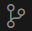
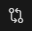

Visual Studio Code is a text and code editor introduced by Microsoft in 2015. It very rapidly became the most popular editor in the programming world. As of 2023 74% of programmers surveyed by Stack Overflow were using it. VS Code runs on Windows, Linux, and macOS.

> VS Code is built on the [Electron](https://www.electronjs.org/) framework. Electron uses the Node.js JavaScript runtime and the Chromium layout engine to support building desktop applications using web technologies - HTML, CSS, and JavaScript. If you are a skilled Web front-end developer you might consider Electron for building desktop apps.

## 1. Install VS Code

If you haven't done so already, download and install VS Code from the [Official Web Site](https://code.visualstudio.com/Download).

The default options generally work best.

## 2. Orienting Yourself

The main space in the application is given to the text editor window. Across the top of that window are tabs for all open files.

Down the left side are icons for the five major functions:
*  File Explorer
*  Search
*  Source Control
*  Run and Debug
*  Extensions

VS Code treats a folder (directory) and all of its subfolders (subdirectories) as a project. This correlates well with **Git** and with most software development platforms. Open a folder by selecting `File > Open Folder...`. Ideally, choose a folder that has source code in it.

Click the  Explorer icon if it has not already been selected. It will show you all of the files in the selected folders with an expandable tree to view files in subfolders. Click a file and it will open in the editor.

Select `File > Auto Save` in the menu. If it is checked, then any changes you make to files will be saved automatically whenever you pause for a moment in your editing. If it is unchecked, then you must save changes by clicking `File > Save`, `File > Save All` or `Ctrl+S` to save or `Ctrl+K S` to save all.

Click the  Search icon on the left. This opens a search panel that lets you search all files in the project. You can click the small `.*` icon to switch to use Regular Expressions in your search pattern.

Click the  Source Control icon on the left. If the directory you're working on is already under source control this is where you can commit and push changes or pull changes from GitHub. If it's not under source control you can create a repository and push it to GitHub. For more detail, see the [Git Walkthrough](git-walkthrough) from last week.

The  Run and Debug icon works differently depending on your programming language, build tools, and add-ins. We will not go into detail in this walkthrough but there is good information on the [VS Code Website](https://code.visualstudio.com/docs).

Click the  Extensions icon. There is a huge library of available extensions for different programming environments and you can [write your own](https://code.visualstudio.com/api/get-started/your-first-extension) in JavaScript. Two extensions I use are [Code Spell Checker](https://marketplace.visualstudio.com/items?itemName=streetsidesoftware.code-spell-checker) and [Hex Editor](https://marketplace.visualstudio.com/items?itemName=ms-vscode.hexeditor). The former is great for writing documentation. The latter will be useful in this class as you look at the binary format of files.

The **Status Bar** at the bottom of the application does more than give information. It's active, you can click on things there. For example, if your folder is a Git repo, it will indicate the current branch in the lower-left. You can click on the branch name to change branches. Next to that it shows error and problem counts. The **Code Spell Checker** is integrated with that and it shows the count of unrecognized words. Clicking on the number will show where the issues are located. The lower-right shows information about the file including tab spacing, line-end encoding, file type, and more. Hovering your mouse over that information will offer more detail and clicking on many of those will let you change things.

## 3. Operations and Tips

Open a file you don't mind changing or create a new file so that you can experiment. The best way to create a new file is to select the `Explorer` icon and click the `New File` icon at the top of the explorer. Choose a source code file type such as `.c`.

Select some text by clicking and dragging the mouse. You can also select by holding `Shift` and using the arrow keys. Practice `Cut`, `Copy`, and `Paste` by either using the operations from the `Edit` menu or using the keyboard shortcuts, `Ctrl-X`, `Ctrl-C`, and `Ctrl-V`.

Select some text and press `Ctrl-/`. This will comment out the text using whatever comment format is appropriate for the file format you are using.

Press `Ctrl-F` and experiment with **Find** and **Replace**. Remember, `Ctrl-F` will bring up the **Find** box at the top of the screen and clicking the `>` Expand icon will open the box to include **Replace**. If you click the `.*` icon you can use **Regular Expressions** for search and replace which is quite powerful. If you want to learn regular expressions you can try the [BYU IT&C 210 Regular Expression Walkthrough](https://byu-itc-210.github.io/walkthrough/Regex) which uses VS Code for regular expression practice.

Click somewhere in the text, hold `Shift-Alt`, and drag your mouse. You can select a rectangular area and then **Delete**, **Copy**, or **Cut**.

Click somewhere and the cursor goes there. Hold `Alt` and click somewhere else; you get **two cursors!** Hold `Alt` and click again. Now you have **three cursors**. Now start typing and your text will appear in all three places. Press `backspace` or `delete` and text will be deleted in all places. This is handy when you need to add the same text or make the same edit in multiple places.

Click the  Changes icon in the upper-right. It will show you all changes you have made in this editing session.

Click the  Split icon in the upper-right. You get a split screen so that you can look at two parts of the same file at once.

Press `Ctrl-K O`. You get a whole new window with the same source file. If you have `Auto Save` turned on then edits replicate between the two windows. Otherwise, you have to `Save` before edits in one window appear in the other.

Press `Ctrl-Shift-P`. The **Command Palette** opens with list of all commands (there are a lot) along with shortcuts. You can type the name of a command to execute it. Through the `File > Preferences > Keyboard Shortcuts` menu you can assign commands to keyboard shortcuts.

## Terminal

You can open a terminal directly in VS code. Just select `View > Terminal` in the menu or use the keyboard shortcut. On Windows, the terminal defaults to PowerShell while on Linux and macOS it defaults to Bash and Zsh respectively. But if you have multiple CLIs installed it you can change which terminal or open multiple terminals. For example, on Windows you can open the old DOS "Command Prompt", PowerShell, JavaScript, and (if you have them installed), Git Bash, and the Linux Subsystem for Windows.

Personally, I prefer opening a separate terminal window but many people prefer the integrated terminal.

## More Information

* View the [Official Documentation for VS Code](https://code.visualstudio.com/docs) which kicks off with a Getting Started guide and includes introduction videos.
* View the [VS Code Keyboard Shortcut page](https://code.visualstudio.com/shortcuts/keyboard-shortcuts-windows.pdf)

